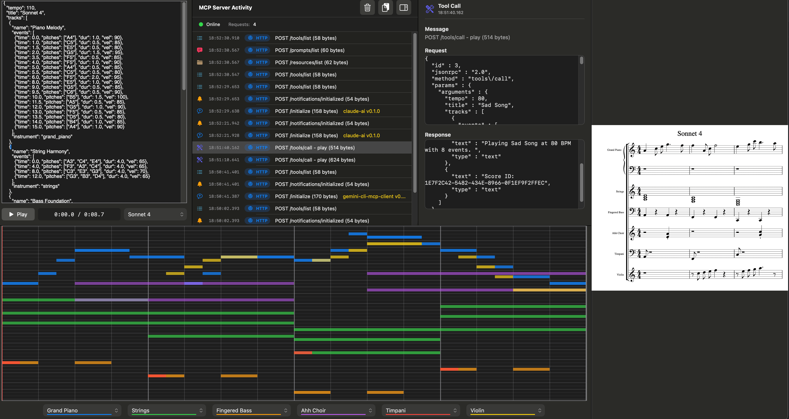

# RiffMCP

RiffMCP is an MCP server that allows LLMs to create and render music

[](docs/images/riffmcp_screenshot_1.png)

## Overview
- Local MCP server that runs as a macOS app  
- Handles the MCP stdio protocol, which is routed to a built-in HTTP server  
- Defines a JSON-based music sequence format used between the LLM and the MCP server  
- Multi-track music is played back using a high quality soundfont  
- Supports basic sheet music rendering  

## How It works
- Add RiffMCP to Claude Desktop, Gemini CLI, or any LLM that supports MCP servers (see *Setup* below).  
- Once configured, you can chat with the LLM to generate music or view the rendered output.  

## Watch demo

## Usage examples
- “Play a happy melody” or “Play a sad melody”  
- “Play a cascading blues minor scale with varying tempo”  
- “Play a 12 bar jazz progression with walking bass”  
- “Show me the sheet music for that”  
- “What instruments are available?”  

## Why build an MCP server as an app?
- In addition to MCP functionality, I wanted an interface that allows monitoring MCP activity, a simple JSON editor for experimentation, and a piano roll to see how playback is working.  
- The challenge became how to implement MCP stdio protocol, an HTTP server, and a GUI simultaneously *without* any Node.js/Electron dependencies or separate daemon processes. The goal is to have only one native app running.  
- The solution was to use a [smart app / proxy mode architecture](docs/proxy-mode.md).  
<br>

# Setup

First, add RiffMCP.app to the Applications folder and run it. The HTTP server starts automatically on port 3001. Next, configure an LLM to use it.

## Setup with Claude Desktop
1. **Add to Claude Desktop configuration:**
   Add this to your Claude Desktop app configuration file:
   
   **Location:** `~/Library/Application Support/Claude/claude_desktop_config.json`

2. **Create or extend the top-level "mcpServers" object:**
   ```json
   {
     "mcpServers": {
       "riff": {
         "command": "/Applications/RiffMCP.app/Contents/MacOS/RiffMCP",
         "args": ["--stdio"]
       }
     }
   }
   ```   

3. **Restart Claude Desktop** to activate the configuration.

## Setup with Gemini CLI
1. **Edit <project>/.gemini/settings.json**

2. **Create or extend the top-level "mcpServers" object:**
   ```json
   {
     "mcpServers": {
       "riff": {
         "command": "/Applications/RiffMCP.app/Contents/MacOS/RiffMCP",
         "args": ["--stdio"]
       }
     }
   }
   ```

3. **Restart Gemini CLI** to activate the configuration.
<br><br>

# For LLMs that don't support MCP servers
- Grab the prompt from [PROMPT_PIANO.md](docs/PROMPT_PIANO.md) or [PROMPT_MULTITRACK.md](docs/PROMPT_MULTITRACK.md)
- This will prompt any LLM to generate RiffMCP json format
- Copy the output and paste it into the json editor window in the RiffMCP app
- Press the Play button
<br><br>

# License
- Apache License, Version 2.0
- Copyright 2025 Lee Whitney