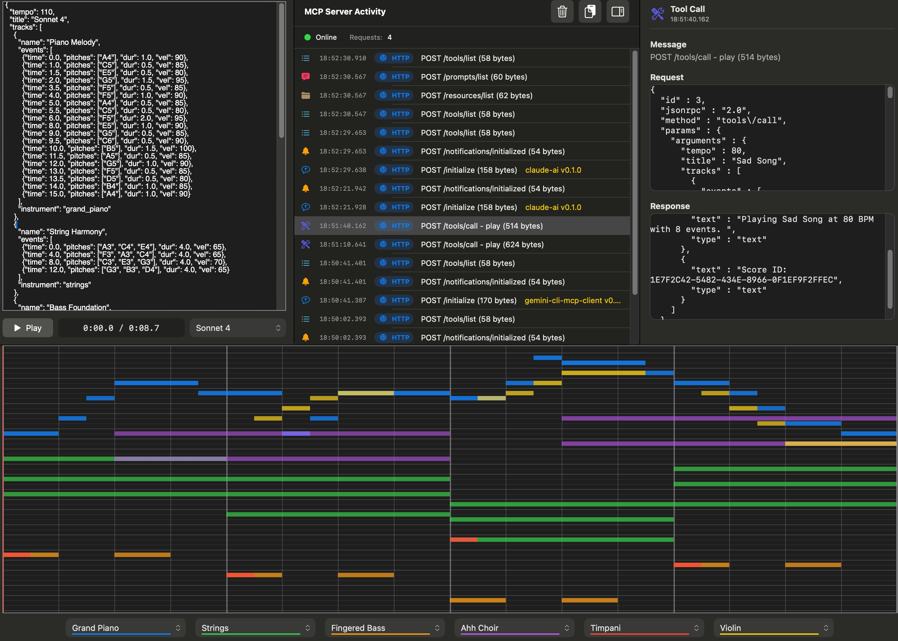
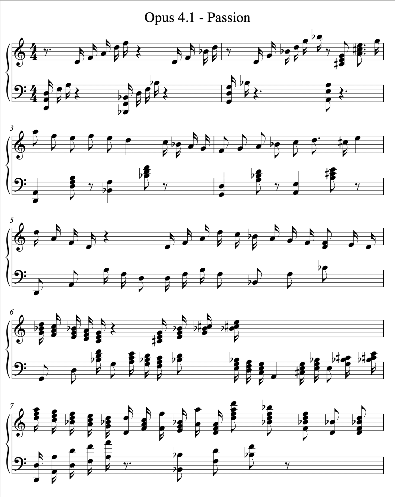
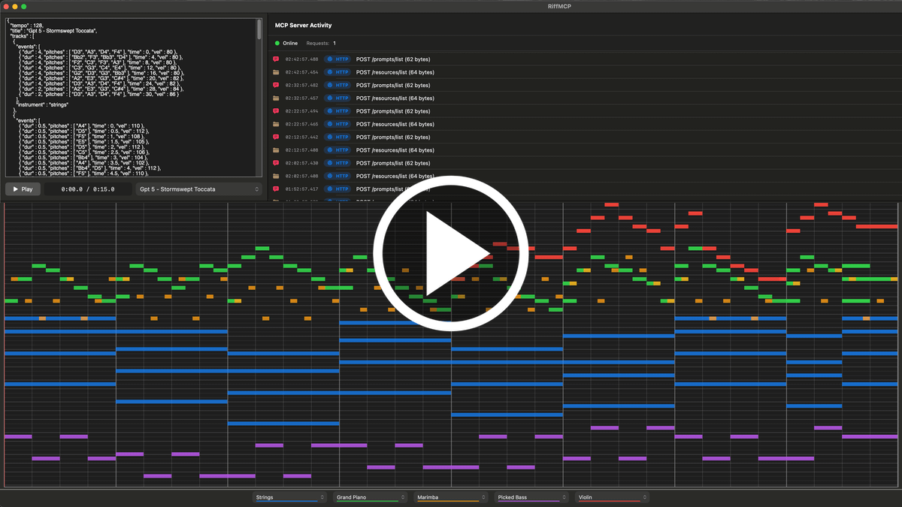
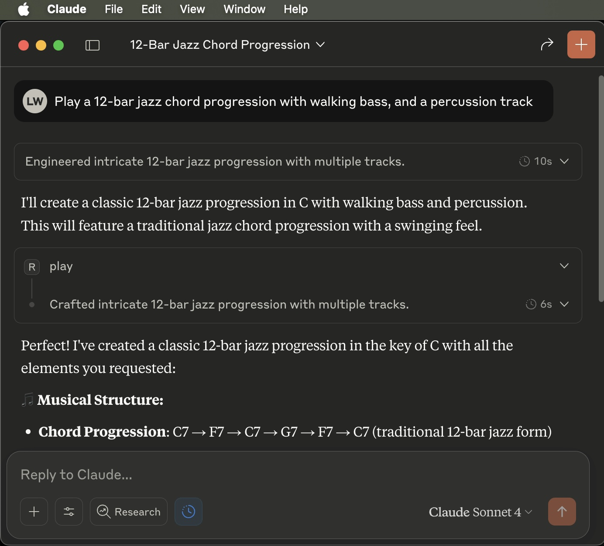
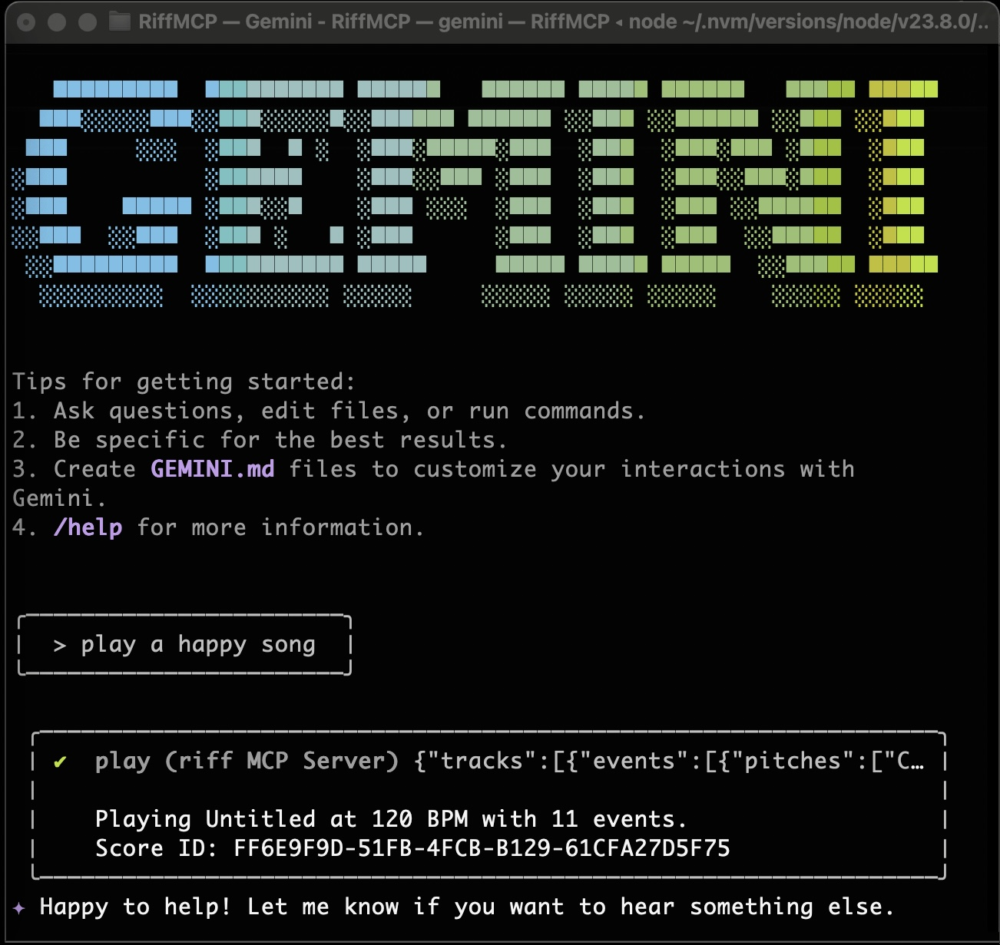

# RiffMCP

RiffMCP is an MCP server that allows LLMs to play, compose, and render music.

<table>
    <tr>
        <td width="63%">
        <a href="docs/images/riffmcp_screenshot_1a.png">
            
        </a>
        </td>
        <td>&nbsp;</td>
        <td width="35%">
        <a href="docs/images/opus41passion.png">
            
        </a>
        </td>
    </tr>
</table>

## Overview
- Local MCP server that runs as a native macOS app  
- Uses MCP stdio protocol which is routed to a built-in HTTP server  
- Defines a JSON-based music sequence format used between the LLM and the MCP server  
- Multi-track music is played back using a high quality soundfont  
- Supports basic sheet music rendering  

## Watch Demo
<p align="center">
    <a href="https://youtu.be/Ksfw34dtIro?si=UilcE5AulSvaB_63">
        
    </a>
</p>

## How It works
- Add RiffMCP to Claude Desktop, Gemini CLI, or any LLM that supports MCP servers (see *Setup* below).  
- Once configured, you can chat with the LLM to generate music or view the rendered output.  

<table>
    <tr>
        <td width="45%">
        <a href="docs/images/claude.jpg">
            
        </a>
        </td>
        <td width="5%">&nbsp;</td>
        <td width="45%">
        <a href="docs/images/gemini.jpg">
            
        </a>
        </td>
    </tr>
</table>

## Usage examples
- “Play a happy melody” or “Play a sad melody”  
- “Play a cascading blues minor scale with varying tempo”  
- “Play a 12 bar jazz progression with walking bass”  
- “Show me the sheet music for that”  
- “What instruments are available?”  

## Why build an MCP server as an app?
- In addition to MCP functionality, I wanted an interface that allows monitoring MCP activity, a simple JSON editor for experimentation, and a piano roll to see how playback is working.  
- The challenge became how to implement MCP stdio protocol, an HTTP server, and a GUI simultaneously *without* any Node.js/Electron dependencies or separate daemon processes. The goal is to have only one native app running.  
- The solution was to use a [smart app / proxy mode architecture](docs/proxy-mode.md).  
<br>

# Setup

1. [Download & open .dmg]([https://dmg](https://github.com/whitneyland/riffmcp/releases/download/v0.1.0/RiffMCP-0.1.0.dmg))
2. Drag app to Applications then run it
3. Update your LLM config file with 4 lines as shown below, restart the LLM
4. Try a chat, “Play a happy melody"

## Add RiffMCP to Claude Desktop
1. **Add to Claude Desktop configuration:**
   Add this to your Claude Desktop app configuration file:
   
   **Location:** `~/Library/Application Support/Claude/claude_desktop_config.json`

2. **Create or extend the top-level "mcpServers" object:**
   ```json
   {
     "mcpServers": {
       "riff": {
         "command": "/Applications/RiffMCP.app/Contents/MacOS/RiffMCP",
         "args": ["--stdio"]
       }
     }
   }
   ```   

3. **Restart Claude Desktop** to activate the configuration.

## Add RiffMCP to Gemini CLI
1. **Edit <project>/.gemini/settings.json**

2. **Create or extend the top-level "mcpServers" object:**
   ```json
   {
     "mcpServers": {
       "riff": {
         "command": "/Applications/RiffMCP.app/Contents/MacOS/RiffMCP",
         "args": ["--stdio"]
       }
     }
   }
   ```

3. **Restart Gemini CLI** to activate the configuration.
<br><br>

# For LLMs that don't support MCP servers
- Grab a prompt from [PROMPT_PIANO.md](docs/prompts/PROMPT_PIANO.md) or [PROMPT_MULTITRACK.md](docs/prompts/PROMPT_MULTITRACK.md)
- This will prompt any LLM to generate RiffMCP json format
- Copy the output and paste it into the json editor window in the RiffMCP app
- Press the Play button
<br><br>

# Limitations
- Sheet music rendering uses the powerful Verovio engine, but not all features are implemented. Still needs triplets, multi-page output, etc.
- Web server is a minimal hand-rolled implementation. swift-nio may be added as a more scalable/robust component.
<br><br>

# License
- Apache License, Version 2.0
- Copyright 2025 Lee Whitney
